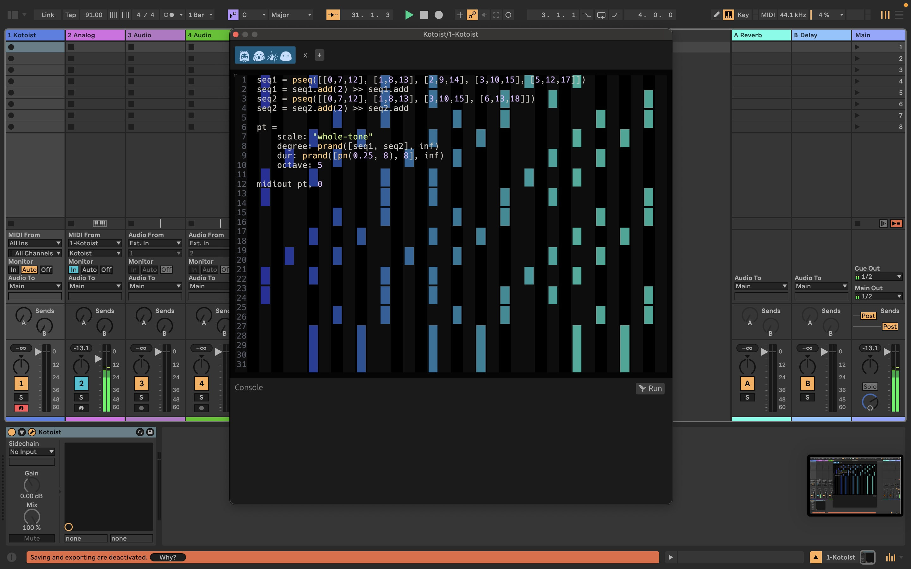

Kotoist
=======

VST plugin for live coding using [Koto](koto.dev/) programming language.

https://github.com/user-attachments/assets/b488713b-43dd-4495-a64f-692babbd43be




## Usage

Checkout documentation: https://kotoist.alestsurko.by.

Tested in **Ableton** and **FL Studio** on macOS. Also tested in **Logic Pro**
via [Element](https://kushview.net/element/).

Might not work in **Reaper** as it steals keyboard input from the plugin.
Previous workaround with enabling option **"Send all keyboard input to plugin"**
doesn't work anymore.


## Build

On macOS:

```
cargo xtask bundle-universal -p kotoist --release
```
On other systems:

```
cargo xtask bundle -p kotoist --release
```


## Deployment

> [!WARNING]
> Needs update.

Just tag a new version and push it to remote.

```
git tag {version}
git push origin {version}
```


### Docs

You need [doctave](https://github.com/Doctave/doctave) and **gh-pages** node
package.

To install **gh-pages** (it's important to use 3.0.0 version):

```
npm install -g gh-pages@3.0.0
```

Building and deploying the docs:

```
doctave build --release
gh-pages -d site
```
